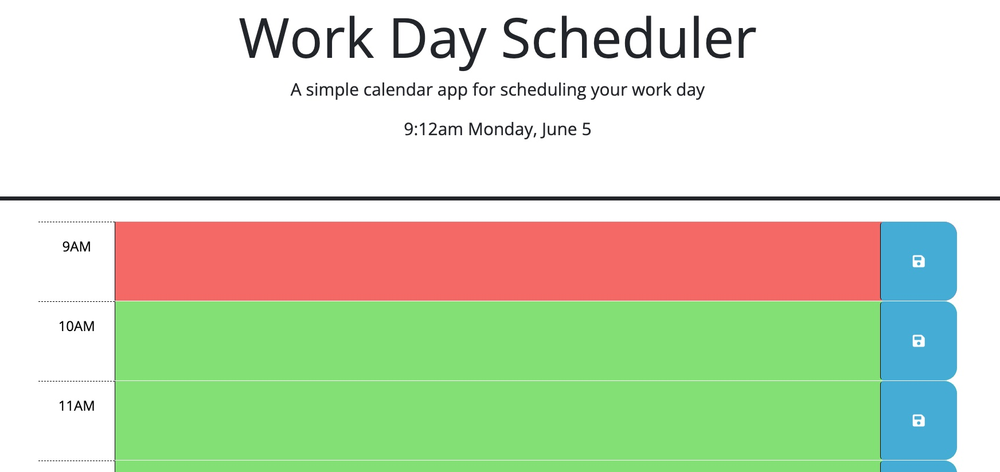

# Work Day Scheduler

## Description

Provided with a baseline of code and the idea to have a planner with time blocks for the working day. The user can input into the text fields for specific hour time blocks through the working day. The Planner also has a built in timer setting so the blocks will be color coded past on if they're in the past(grey) present(red) or future(green). The application also utilizes local storage to keep track of the users input as page reloads occur. 

## Installation

N/A

## Usage

### Deployed App URL

https://dsstad.github.io/work-day-scheduler/

## Credits 

starter code and instructions provided by DU coding Bootcamp

